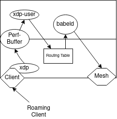

# x3roam

We utilize XDP for checking if another client roamed from another network. If the client roamed, we will signal the userspace part via an event that it should install a routing rule to the client. Babeld will then also announce a route to the client.